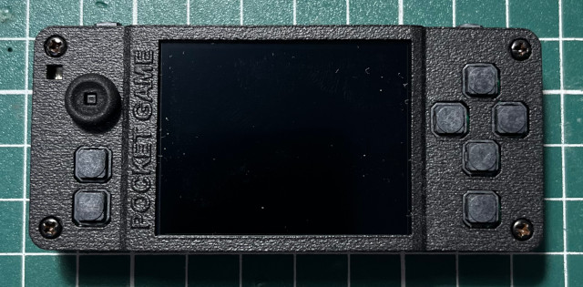

# Kernel
This kernel is based on Tina-Linux and has been extensively modified to meet the requirements of the Gaviar handheld.  

  

&nbsp;

# Building Steps
```
$ wget https://github.com/steward-fu/website/releases/download/gaviar/thead_toolchain.tar.gz
$ tar xvf thead_toolchain.tar.gz
$ sudo mv thead /opt
$ export PATH=/opt/thead/bin:$PATH

$ ARCH=riscv CROSS_COMPILE=riscv64-unknown-linux-gnu- make distclean
$ ARCH=riscv CROSS_COMPILE=riscv64-unknown-linux-gnu- make gaviar_defconfig
$ ARCH=riscv CROSS_COMPILE=riscv64-unknown-linux-gnu- make menuconfig
$ ARCH=riscv CROSS_COMPILE=riscv64-unknown-linux-gnu- make Image dtbs -j4

$ sudo dd if=arch/riscv/boot/Image of=/dev/sdX   bs=1024 seek=400
$ sudo dd if=arch/riscv/boot/dts/sunxi/board.dtb of=/dev/sdX bs=1024 seek=300
```
