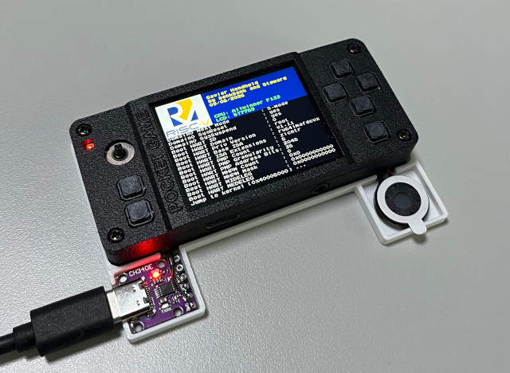

# OpenSBI
This OpenSBI is a heavily modified version tailored to the requirements of the Gaviar handheld. Basically, we integrated a lightweight bootloader into OpenSBI and added display initialization and rendering functionality specifically for the Gaviar handheld.  



&nbsp;

# Building Steps
```
$ wget https://github.com/steward-fu/website/releases/download/gaviar/thead_toolchain.tar.gz
$ tar xvf thead_toolchain.tar.gz
$ sudo mv thead /opt
$ export PATH=/opt/thead/bin:$PATH

$ export PLATFORM=allwinner/f133
$ export CROSS_COMPILE=riscv64-unknown-linux-gnu-

$ make distclean
$ CONFIG=BROM make
$ python3 scripts/gen_checksum.py ./build/platform/allwinner/f133/firmware/fw_jump.bin fw_jump.bin
$ dd if=fw_jump.bin of=payload/brom.bin bs=1024 count=32
$ rm -rf fw_jump.bin

$ make distclean
$ make
$ python3 scripts/gen_checksum.py ./build/platform/allwinner/f133/firmware/fw_jump.bin payload/fw_jump.bin
$ python3 scripts/gen_checksum.py ./build/platform/allwinner/f133/firmware/fw_payload.bin payload/fw_payload.bin

$ sudo dd if=payload/brom.bin    of=/dev/sdX bs=1024 seek=8
$ sudo dd if=payload/fw_jump.bin of=/dev/sdX bs=1024 seek=40
```
